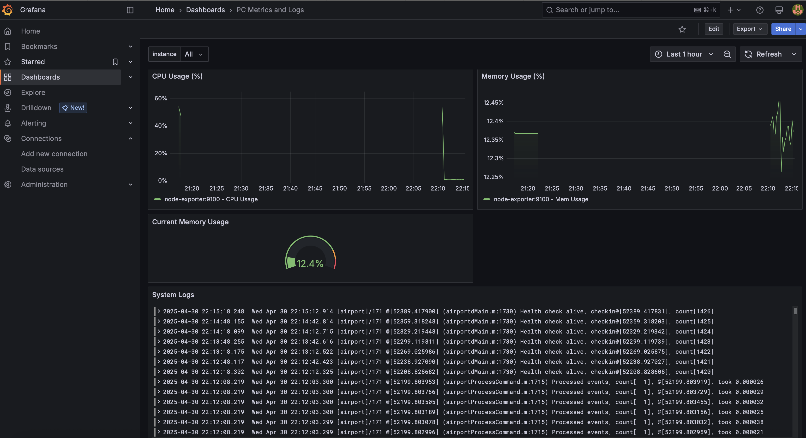

# Local PC Monitoring Dashboard with Docker



## Overview

This project sets up a comprehensive monitoring stack using Docker Compose to collect and visualize metrics and logs from your local machine (PC/Mac). It utilizes industry-standard open-source tools:

*   **Prometheus:** For time-series metric collection and storage.
*   **Loki:** For log aggregation, designed for efficiency and Prometheus-like label querying.
*   **Promtail:** The agent that ships local logs to Loki.
*   **Grafana:** For visualizing metrics and logs in dashboards.

## Features

*   **System Metrics:** Monitors key system resources like CPU Usage and Memory Usage.
*   **Log Aggregation:** Collects logs from `/var/log` (specifically `*.log` files) on the host machine using Promtail.
*   **Unified Dashboard:** Provides a Grafana dashboard displaying both metrics and logs.
*   **Dockerized:** All components run in Docker containers for easy setup, teardown, and isolation.
*   **Configurable:** Uses external configuration files for Prometheus, Loki, and Promtail, allowing customization.

## Prerequisites

*   **Docker Engine:** [Install Docker](https://docs.docker.com/engine/install/)
*   **Docker Compose:** Usually included with Docker Desktop (Mac/Windows) or installed separately on Linux ([Install Docker Compose](https://docs.docker.com/compose/install/)).

## Setup

1.  **Clone the Repository:**
    ```bash
    git clone https://github.com/philosoph10/Dashboard
    ```

2.  **Start the Stack:**
    ```bash
    docker-compose up -d
    ```
    This will pull the necessary images and start all the services in the background.

## Usage

1.  **Access Grafana:**
    *   Open your web browser and navigate to `http://localhost:3000`.
    *   Log in using:
        *   Username: `admin`
        *   Password: `admin`.

2.  **Import Dashboard (if needed):**
    *   If the dashboard isn't pre-loaded, go to Dashboards -> + Import.
    *   Upload or paste the dashboard JSON file generated previously.
    *   You will be prompted to select the **Prometheus** and **Loki** data sources. Ensure you choose the ones configured by Grafana (they should be auto-detected if Grafana started correctly after Loki/Prometheus).

3.  **Explore Metrics and Logs:**
    *   View the imported dashboard ("PC Metrics and Logs" or similar).
    *   Use Grafana's "Explore" view to query Prometheus and Loki directly.

4.  **Other Services:**
    *   **Prometheus UI:** `http://localhost:9090` (Useful for checking targets and metrics).
    *   **Loki:** Generally accessed via Grafana, but its API is on `http://localhost:3100`.


## Components

*   **Prometheus:** Time-series database & monitoring system.
*   **Loki:** Log aggregation system like Prometheus, but for logs.
*   **Promtail:** Agent for shipping logs to Loki.
*   **Grafana:** Visualization platform for dashboards and exploring data.
*   **Docker/Docker Compose:** Containerization and orchestration tools.

---

Developed by **Yur-Liubomysl Dekhtiar**